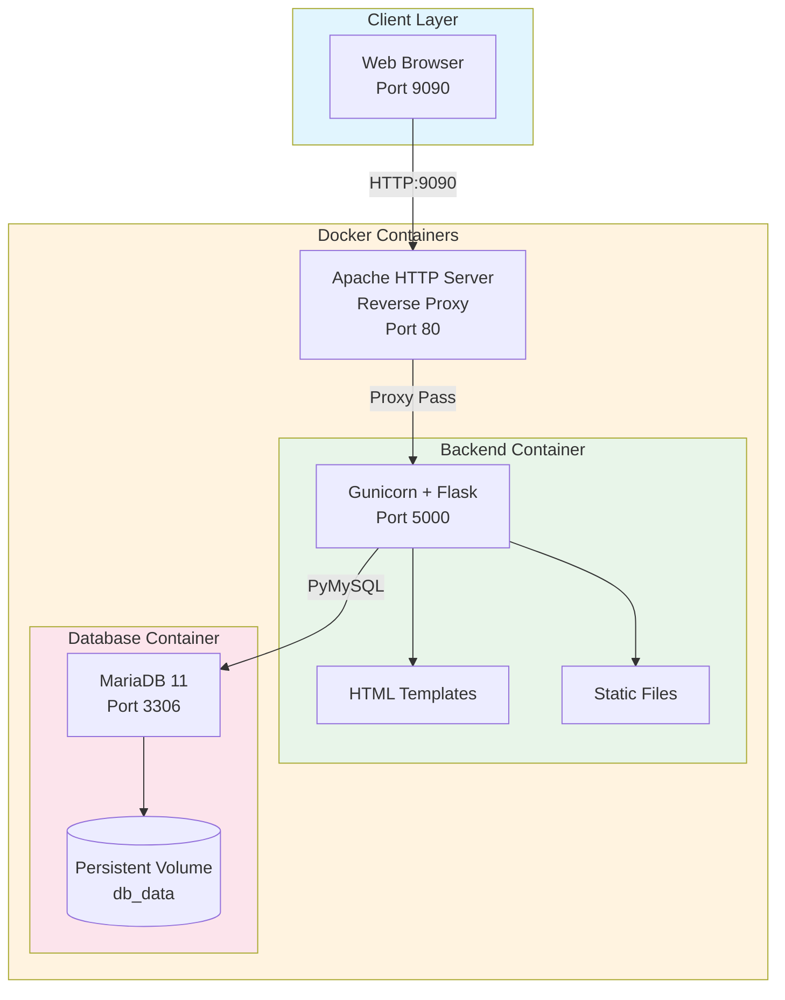
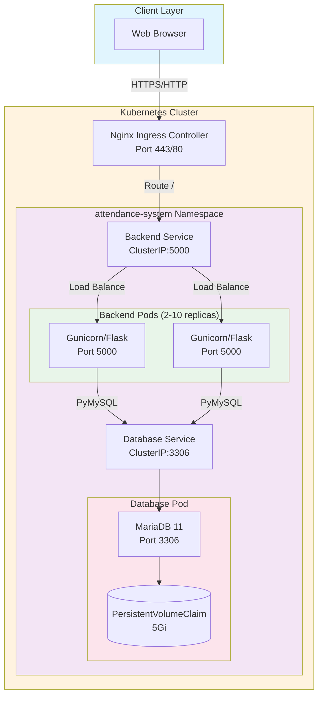

# QR Code Student Identification and Attendance System

A comprehensive attendance management system for Batangas State University ARASOF-Nasugbu that leverages QR code technology for efficient student identification and real-time attendance tracking.

## Quick Start

```bash
# Clone and navigate to project
cd /workspace

# Create environment file
cat > .env << EOF
MYSQL_ROOT_PASSWORD=rootpassword
MYSQL_DATABASE=attendance_db
MYSQL_USER=attendance_user
MYSQL_PASSWORD=attendance_secure_password_2025
JWT_SECRET=super_secure_jwt_secret_key_change_in_production_2025
ADMIN_USERNAME=admin
ADMIN_PASSWORD=admin123
FLASK_ENV=production
EOF

# Start all services with Apache reverse proxy
docker compose up --build -d

# Access the application at http://localhost:9090
# Login with: admin / admin123
```

## System Architecture

### Docker Compose Architecture (Apache)



### Kubernetes Architecture (Production)



### Architecture Components Flow

#### Docker Compose (Development/Small Production)
1. **Browser** → User accesses via `http://localhost:9090`
2. **Apache** → Reverse proxy forwards requests to backend container
3. **Gunicorn/Flask** → Application server processes requests
4. **MariaDB** → Persistent database with volume storage

#### Kubernetes (Large Production)
1. **Browser** → User accesses the web application via HTTPS
2. **Nginx Ingress** → Routes external traffic, applies rate limiting and security headers
3. **Backend Service** → Kubernetes ClusterIP service load-balances requests across backend pods
4. **Gunicorn/Flask Pods** → Application servers process requests (auto-scales based on CPU)
5. **Database Service** → Internal ClusterIP service for database connectivity
6. **MariaDB** → Persistent database with PVC for data durability

## Tech Stack

| Component | Technology |
|-----------|------------|
| Backend Framework | Flask (Python 3.11) |
| Database | MariaDB 11 |
| ORM/Database Driver | PyMySQL |
| Authentication | JWT (PyJWT) + Werkzeug Password Hashing |
| Email Service | Flask-Mail |
| QR Code Generation | qrcode + Pillow |
| Frontend Templates | Jinja2 |
| CSS Framework | Bootstrap 5 (CDN) |
| JavaScript | Vanilla JS |
| QR Scanner | html5-qrcode (CDN) |
| Web Server (Docker) | Gunicorn + Apache HTTP Server |
| Web Server (K8s) | Gunicorn + Nginx Ingress |
| Containerization | Docker + Docker Compose |
| Orchestration | Kubernetes (Deployments, Services, HPA, Ingress) |

## Local Development Setup

Choose your preferred deployment method:

### Option 1: Docker Compose with Apache (Simplest - Recommended)

**Quick Start:**
```bash
# Create environment file
cat > .env << EOF
MYSQL_ROOT_PASSWORD=rootpassword
MYSQL_DATABASE=attendance_db
MYSQL_USER=attendance_user
MYSQL_PASSWORD=attendance_secure_password_2025
JWT_SECRET=super_secure_jwt_secret_key_change_in_production_2025
ADMIN_USERNAME=admin
ADMIN_PASSWORD=admin123
FLASK_ENV=production
EOF

# Start all services with Apache reverse proxy
docker compose up --build -d

# Access at http://localhost:9090
```

**Apache Configuration:**
- Reverse proxy forwards requests from port 9090 to backend (port 5000)
- Logs available at: `docker logs attendance_apache`
- Config file: `apache/proxy.conf`

### Option 2: Kubernetes with Kind (Production-Like Environment)

See **[LOCAL_SETUP_GUIDE.md](LOCAL_SETUP_GUIDE.md)** for detailed Kind setup instructions.

**Quick Start:**
```bash
# Create Kind cluster
kind create cluster --name attendance-cluster

# Install Nginx Ingress Controller
kubectl apply -f https://raw.githubusercontent.com/kubernetes/ingress-nginx/main/deploy/static/provider/kind/deploy.yaml

# Deploy application
kubectl apply -f k8s/

# Port forward to access
kubectl port-forward -n ingress-nginx svc/ingress-nginx-controller 80:80
```

### Option 3: Full Documentation

For comprehensive setup instructions including:
- Complete Docker Compose walkthrough
- Kubernetes (Kind) cluster configuration
- Security feature testing
- Troubleshooting guide
- Architecture diagrams

👉 **See [LOCAL_SETUP_GUIDE.md](LOCAL_SETUP_GUIDE.md)** 👈

---

## Kubernetes Deployment

### Prerequisites

- Kubernetes cluster (GKE, EKS, AKS, or local Minikube/Kind)
- `kubectl` configured to communicate with your cluster
- Nginx Ingress Controller installed in the cluster
- Metrics Server enabled (required for HPA)

### Deploy to Kubernetes

1. **Apply all Kubernetes manifests:**
   ```bash
   kubectl apply -f k8s/namespace.yaml
   kubectl apply -f k8s/pvc.yaml
   kubectl apply -f k8s/configmap.yaml
   kubectl apply -f k8s/secret.yaml
   kubectl apply -f k8s/db-init-configmap.yaml
   kubectl apply -f k8s/db-deployment.yaml
   kubectl apply -f k8s/db-service.yaml
   kubectl apply -f k8s/backend-deployment.yaml
   kubectl apply -f k8s/backend-service.yaml
   kubectl apply -f k8s/ingress.yaml
   kubectl apply -f k8s/hpa.yaml
   ```

   Or apply all at once:
   ```bash
   kubectl apply -f k8s/
   ```

2. **Verify deployment:**
   ```bash
   kubectl get all -n attendance-system
   ```

3. **Check pod status:**
   ```bash
   kubectl get pods -n attendance-system
   ```

4. **Get the external IP:**
   ```bash
   kubectl get ingress -n attendance-system
   ```

5. **Access the application:**
   - Add entry to `/etc/hosts`: `<EXTERNAL_IP> attendance.local`
   - Open browser to `http://attendance.local`

### Deploy to Google Cloud GKE

1. **Create a GKE cluster:**
   ```bash
   gcloud container clusters create attendance-cluster \
     --num-nodes=3 \
     --machine-type=e2-medium \
     --zone=us-central1-a
   ```

2. **Configure kubectl:**
   ```bash
   gcloud container clusters get-credentials attendance-cluster --zone us-central1-a
   ```

3. **Enable required APIs:**
   ```bash
   gcloud services enable container.googleapis.com
   ```

4. **Install Nginx Ingress Controller:**
   ```bash
   kubectl apply -f https://raw.githubusercontent.com/kubernetes/ingress-nginx/main/deploy/static/provider/cloud/deploy.yaml
   ```

5. **Deploy the application:**
   ```bash
   kubectl apply -f k8s/
   ```

6. **Get the external load balancer IP:**
   ```bash
   kubectl get ingress attendance-ingress -n attendance-system
   ```

7. **Update DNS or /etc/hosts:**
   Point `attendance.local` to the external IP from step 6.

### Deploy to AWS EKS

1. **Create an EKS cluster:**
   ```bash
   eksctl create cluster \
     --name attendance-cluster \
     --region us-west-2 \
     --nodes 3 \
     --node-type t3.medium
   ```

2. **Configure kubectl:**
   ```bash
   aws eks update-kubeconfig --region us-west-2 --name attendance-cluster
   ```

3. **Install Nginx Ingress Controller:**
   ```bash
   kubectl apply -f https://raw.githubusercontent.com/kubernetes/ingress-nginx/main/deploy/static/provider/aws/deploy.yaml
   ```

4. **Deploy the application:**
   ```bash
   kubectl apply -f k8s/
   ```

5. **Get the external load balancer IP:**
   ```bash
   kubectl get ingress attendance-ingress -n attendance-system
   ```

6. **Update Route53 or /etc/hosts:**
   Point your domain to the external IP from step 5.

### Scaling and Monitoring

1. **Check HPA status:**
   ```bash
   kubectl get hpa -n attendance-system
   ```

2. **Manually scale backend:**
   ```bash
   kubectl scale deployment attendance-backend --replicas=5 -n attendance-system
   ```

3. **View resource usage:**
   ```bash
   kubectl top pods -n attendance-system
   ```

4. **View logs:**
   ```bash
   kubectl logs -f deployment/attendance-backend -n attendance-system
   ```

### Cleanup

```bash
kubectl delete namespace attendance-system
```

## Folder Structure

```
/workspace/
├── backend/
│   ├── app.py                 # Main Flask application
│   ├── config.py              # Configuration loader
│   ├── requirements.txt       # Python dependencies
│   ├── schema.sql             # Database schema and seed data
│   ├── Dockerfile             # Backend container definition
│   ├── .env.example           # Environment variables template
│   └── utils/
│       ├── __init__.py
│       ├── qr_generator.py    # QR code generation utility
│       └── email_sender.py    # Email sending utility
├── frontend/
│   ├── templates/
│   │   ├── base.html          # Base template with navbar/sidebar
│   │   ├── login.html         # Login page
│   │   ├── dashboard.html     # Dashboard overview
│   │   ├── scanner.html       # Live QR scanner page
│   │   ├── students.html      # Student management
│   │   ├── courses.html       # Course management
│   │   └── attendance.html    # Attendance records
│   └── static/
│       ├── css/
│       │   └── style.css      # Custom minimalist styles
│       ├── js/
│       │   ├── scanner.js     # QR scanner logic
│       │   ├── students.js    # Student CRUD operations
│       │   ├── courses.js     # Course CRUD operations
│       │   └── attendance.js  # Attendance filtering/export
│       └── images/
│           └── qrcodes/       # Generated QR code images
├── k8s/
│   ├── namespace.yaml         # Kubernetes namespace definition
│   ├── configmap.yaml         # Non-sensitive configuration
│   ├── secret.yaml            # Sensitive credentials (base64 encoded)
│   ├── pvc.yaml               # PersistentVolumeClaim for database
│   ├── db-deployment.yaml     # MariaDB deployment with PVC
│   ├── db-service.yaml        # Database ClusterIP service
│   ├── db-init-configmap.yaml # Database initialization script
│   ├── backend-deployment.yaml# Flask/Gunicorn deployment (2+ replicas)
│   ├── backend-service.yaml   # Backend ClusterIP service
│   ├── ingress.yaml           # Nginx Ingress configuration
│   └── hpa.yaml               # HorizontalPodAutoscaler (70% CPU target)
├── docker-compose.yml         # Multi-container orchestration (Apache reverse proxy)
├── apache/
│   └── proxy.conf             # Apache reverse proxy configuration
├── SECURITY.md                # Security analysis and risk assessment
├── KIND_DEPLOYMENT_GUIDE.md   # Step-by-step Kind (Kubernetes in Docker) setup
├── LOCAL_SETUP_GUIDE.md       # Complete local setup guide (Docker & Kubernetes)
└── README.md                  # This file
```

## Setup Instructions

### Option 1: Local Development (Virtual Environment)

1. **Clone and navigate to project:**
   ```bash
   cd /workspace
   ```

2. **Create and activate virtual environment:**
   ```bash
   python3 -m venv venv
   source venv/bin/activate
   ```

3. **Install dependencies:**
   ```bash
   pip install -r backend/requirements.txt
   ```

4. **Configure environment variables:**
   ```bash
   cp backend/.env.example backend/.env
   nano backend/.env  # Edit with your credentials
   ```

5. **Create database and load schema:**
   ```bash
   sudo mariadb -u root -p < backend/schema.sql
   ```

6. **Create QR codes directory:**
   ```bash
   mkdir -p frontend/static/images/qrcodes
   ```

7. **Run the application:**
   ```bash
   cd backend
   python app.py
   ```

8. **Access the application:**
   Open browser to `http://localhost:5000`

### Option 2: Docker Compose with Apache (Recommended for Production)

1. **Ensure Docker and Docker Compose are installed:**
   ```bash
   docker --version
   docker compose version
   ```

2. **Create environment file:**
   ```bash
   cat > .env << EOF
   MYSQL_ROOT_PASSWORD=rootpassword
   MYSQL_DATABASE=attendance_db
   MYSQL_USER=attendance_user
   MYSQL_PASSWORD=attendance_secure_password_2025
   JWT_SECRET=super_secure_jwt_secret_key_change_in_production_2025
   ADMIN_USERNAME=admin
   ADMIN_PASSWORD=admin123
   FLASK_ENV=production
   EOF
   ```

3. **Build and start all services:**
   ```bash
   docker compose up --build -d
   ```

4. **View logs:**
   ```bash
   docker compose logs -f          # All services
   docker logs attendance_apache   # Apache logs
   docker logs attendance_backend  # Backend logs
   docker logs attendance_db       # Database logs
   ```

5. **Access the application:**
   - Via Apache: `http://localhost:9090`
   - Direct backend: `http://localhost:5000`

6. **Stop all services:**
   ```bash
   docker compose down
   ```

7. **Stop and remove volumes (clean slate):**
   ```bash
   docker compose down -v
   ```

## API Endpoints

| Method | Endpoint | Auth Required | Description |
|--------|----------|---------------|-------------|
| GET | `/login` | No | Render login page |
| POST | `/login` | No | Authenticate admin, return JWT token |
| GET | `/logout` | Yes | Clear session and redirect to login |
| GET | `/` | No | Redirect to dashboard or login |
| GET | `/dashboard` | Yes | Get attendance statistics summary |
| GET | `/students` | Yes | Get all students with course info |
| POST | `/students` | Yes | Create new student with QR code |
| PUT | `/students/<id>` | Yes | Update student information |
| DELETE | `/students/<id>` | Yes | Delete student and QR image |
| GET | `/courses` | Yes | Get all courses with teacher and student count |
| POST | `/courses` | Yes | Create new course |
| PUT | `/courses/<id>` | Yes | Update course information |
| DELETE | `/courses/<id>` | Yes | Delete course (if no students enrolled) |
| POST | `/scan` | Yes | Process QR scan and record attendance |
| POST | `/upload-csv` | Yes | Bulk import students from CSV file |
| GET | `/attendance` | Yes | Get attendance records with filters |
| GET | `/attendance/export` | Yes | Export attendance to CSV file |
| GET | `/scanner` | Yes | Render live QR scanner page |

## How to Run the Demo

### Step 1: Start the Application
```bash
cd /workspace
docker compose up --build -d
```

### Step 2: Access the Login Page
Open browser to `http://localhost:9090` (via Apache) or `http://localhost:5000` (direct backend)

### Step 3: Login with Admin Credentials
- **Username:** `admin` (or value from `.env` ADMIN_USERNAME)
- **Password:** `admin123` (or value from `.env` ADMIN_PASSWORD)

### Step 4: Create a Course
1. Navigate to "Courses" in sidebar
2. Click "Add Course"
3. Enter course name, section, and schedule
4. Click "Save"

### Step 5: Add Students
**Option A - Manual Entry:**
1. Navigate to "Students"
2. Click "Add Student"
3. Enter name, email, and select course
4. Click "Save" (QR code auto-generated)

**Option B - CSV Upload:**
1. Prepare CSV with columns: `name,email,course_id`
2. Click "Upload CSV" in Students page
3. Select file and upload
4. QR codes generated and emails sent automatically

### Step 6: Test QR Scanner
1. Navigate to "Scanner"
2. Allow camera access when prompted
3. Hold student QR code in front of camera
4. System displays student info and records attendance
5. Scan again to record time-out

### Step 7: View Attendance Records
1. Navigate to "Attendance"
2. Use filters (date, course, status)
3. View summary statistics
4. Click "Export CSV" to download records

### Step 8: Stop the Application
```bash
docker compose down
```

## Default Credentials

| Role | Username | Password |
|------|----------|----------|
| Admin | `admin` | `admin123` |

**Important:** Change these defaults in `.env` before production deployment.

## Seed Data

The database includes sample data for testing:
- **3 Teachers** with sample credentials
- **6 Courses** across different programs
- **18 Students** (3 per course) with pre-generated QR codes

## Troubleshooting

### Database Connection Issues
```bash
docker compose logs db
docker compose logs backend
```

### QR Code Generation Fails
Ensure directory exists and has write permissions:
```bash
mkdir -p frontend/static/images/qrcodes
chmod 755 frontend/static/images/qrcodes
```

### Email Not Sending
Verify SMTP credentials in `.env`:
- MAIL_SERVER (e.g., smtp.gmail.com)
- MAIL_PORT (587 for TLS, 465 for SSL)
- MAIL_USERNAME
- MAIL_PASSWORD (use app-specific password for Gmail)

## Security

For detailed security analysis, risk assessment, CIA triad mapping, and production hardening checklist, see [**SECURITY.md**](SECURITY.md).

### Key Security Features

| Feature | Implementation | Mitigation |
|---------|---------------|------------|
| **Password Hashing** | Werkzeug (PBKDF2-SHA256) | Prevents plaintext password exposure |
| **JWT Authentication** | 24-hour token expiration | Limits session hijacking window |
| **Security Headers** | X-Frame-Options, CSP, HSTS | Prevents XSS, clickjacking, MIME sniffing |
| **CSV Hardening** | MIME validation, 2MB limit, 200 row max | Prevents malicious file uploads, DoS |
| **Input Sanitization** | Email regex, name stripping | Prevents SQL injection, XSS |
| **Container Isolation** | Separate Docker networks | Limits lateral movement |
| **Horizontal Scaling** | Kubernetes HPA (70% CPU target) | Ensures availability under load |
| **Namespace Isolation** | Dedicated K8s namespace | Logical separation from other apps |

**Note:** Rate limiting can be added to Apache using `mod_ratelimit` or `mod_evasive` modules for production deployments. For Kubernetes deployments, Nginx Ingress Controller provides built-in rate limiting.

### Security Testing Commands

```bash
# Verify security headers (Apache)
curl -I http://localhost:9090 | grep -E "X-Frame-Options|X-Content-Type-Options|Strict-Transport-Security"

# Check container network isolation
docker network inspect attendance_network

# Test backend health
curl http://localhost:5000/login
```

---

## Team Members

**Course:** IT 323 / NTT 404 - Web Systems Technologies  
**Academic Year:** 2025-2026  
**Institution:** Batangas State University ARASOF-Nasugbu

**To be Approved by:**  
Mr. Calvin John V. Placio  
Course Instructor

---

© 2025 QR Code Student Identification and Attendance System  
Batangas State University ARASOF-Nasugbu
